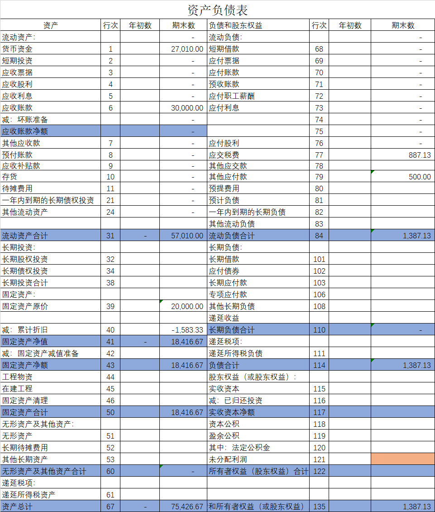

# simple-financial-report-with-excel

simple bookkeeping and report with excel in China

- ## 目标用户

  - 1. 不涉及生产制造的商贸类、服务类企业
    2. 其他有记账报税需求的小型单位
    3. 想要了解财务账报表生成逻辑和excel实现方法的会计初学者

- ## 功能介绍
  - 1. 辅助记账功能：内置了标准的一级会计科目代码和会计科目名称，从下拉菜单中选择一级会计科目，无需手动输入。 
    2. 自动计算折旧功能：输入初始化数据，自动计算本期折旧。
    3. 自动报表功能：根据记账凭证自动生成期末资产负债表、利润表。
    4.自动计算所得税功能：自动测算本期应缴纳的企业所得税。

- ## 使用方法
  - ### 0. 假设用户的业务循环为：企业主营业务为咨询服务，每季度报税，定期收到客户支付的咨询费，定期开具增值税普通发票，定期确认咨询服务收入，定期确认交通费、通讯费等各类费用，定期计提固定资产折旧，定期收到银行存款结息。
  - ### 1. 收到服务款项记账：
    
  	- 1.1 在年月日填写实际收款日期，凭证号填“1”，代表本月第一张记账凭证。
  	- 1.2 行项目填写1、2，表示这张凭证一个有2行。 输入1时单元格自动添加提示性的红色底纹。摘要填写“收到咨询费”，说明这笔业务的经济实质。
  	- 1.3 科目1点击下拉菜单，选择银行存款和预收账款。
  		- tip.1 本单位有多个银行账户的，可以为银行存款添加二级科目，每一个银行账户使用一个二级科目。
  		- tip.2  科目选择预收账款表示该笔款项属于预付性质，我方还未履行合同义务。合同安排系我方先履行合同义务，客户再付款的，此处应选择应付账款科目。
  	- 1.4 银行存款借方填写实收金额，预收账款贷方填写相同金额。
  	- 1.4 预收账款客户名称、编码处，填写付款客户的名称和本企业内部为该客户编制的客户编码。
  - ### 2. 向员工支付报销款
    
  	- 2.1 科目1选择其他应收款。也可使用其他应付款。此二科目可以任选其一使用，但选定后同一类经济业务不要再使用另一科目。
  		- tip.1 此二科目的借方增加均代表向员工实际支付了款项，贷方增加均代表员工向财务部门提交了经审批通过的报销申请单。
  	- 2.2 员工填写申请该笔报销业务的员工姓名。
  - ### 3.确认收入
    
  	- 3.1在我方履行完毕合同义务的季度末，可以确认收入。本季度按照确认收入的金额向客户开具增值税普通发票。
  	- 3.2 主营业务收入贷方填写本季度开具发票的不含税汇总金额。应交税费-增值税销项的贷方填写增值税额。
  	- 3.3 本季度预收的款项，我方在本期履行完毕合同义务的，需要在此处在借方记录相应金额。我方履行完合同义务的部分，客户尚未付款的，在应收账款借方记录相应金额。
  - ### 4. 折旧计算和记账
  	- 4.1 折旧计算
  	  
  		- a. 蓝色部分为自动计算部分，只需输入绿色部分数据。影响计算的关键数据包括：入卡片日期，使用年限，固定资产原值，残值率。入卡片日期是指本企业开始使用该固定资产的日期，一般填写为某年某月的1日；使用年限，电脑、打印机等电子设备一般为3年；原值是指购买时发票的不含税金额；残值率是指到达使用年限后，该固定资产二手市场的卖价，电子设备一般为5%。
  		- b. 数据输入完毕后，对每月折旧额列求和，即为每月应计提的折旧金额。
  	- 4.2折旧记账
  	  
  		- a. 由于电子设备的使用部门为管理部门，所以电子设备的折旧应计入管理费用。其他部门使用的固定资产折旧记账同理。
  		- b. 本例假设每季度报税，故按季度进行折旧记账。 管理费用借方填写相同金额。
  		  #+BEGIN_CENTER
  		  `累计折旧的贷方金额=3*Σ折旧计算表每月折旧额`
  		  #+END_CENTER
  - ### 5. 结息
    
  	- 5.1 银行定期结息的，收到银行存款，故记银行存款借方。银行支付的活期利息，不计入企业收入，而记录为财务费用的减少，又因为财务==费用的增加记录在借方==，故在财务费用借方记录金额相等的负数。
  		- tip. 不建议在财务费用这类损益类科目贷方记录费用的减少，建议通过在借方登记负数的方式记录。因为若财务软件使用账结法计算利润的，会在每一笔凭证损益类科目的对方记录金额。当通过损益类科目贷方记录费用减少时，财务软件计算利润的操作会在借方记录金额。这违背了损益类科目借方增加约定俗成的含义"费用的增加记录在借方"。
  - ### 6. 城市维护建设税、教育费附加、地方教育附加
    
  	- 6.1 税率根据纳税人的经营地不同而有所差异：
  	  
  	  #+BEGIN_CENTER
  	  `城市维护建设税=(==实纳==增值税+==实纳==消费税)*税率`
  	  #+END_CENTER 
  	  
  	- 6.2 教育费附加和地方教育附加
  	  #+BEGIN_CENTER
  	  `应纳教育费附加＝(==实纳==增值税+==实纳==消费税) * 3%`
  	  `应纳地方教育附加＝(==实纳==增值税+==实纳==消费税) * 2%`
  	  #+END_CENTER
  - ### 7.所得税计算
  	- 7.1假设2020年第一季度的会计凭证录入完毕
  	  
  	- 7.2打开透视表，按键盘快捷键`alt + f5`刷新数据透视表数据
  	  
  	- 7.3 资产负债表、利润表已自动生成。
  	  
  	  
  	- 7.4 本手工账使用表结法计算净利润。所以资产负债表未分配利润行项目数据为0,，实际使用时，应将利润表本年累计数填写至资产负债表未分配利润处。此处的未分配利润代表本年的未分配利润。
  	- 7.5 资产负债表下方设置了用于勾稽资产负债表和利润表的公式。
  	  
  		- a. 当记账没有其他错误时，最右侧列的差异金额=利润表所得税项目金额，即为本期应计提的所得税金额。
  		  序时账按该金额记录所得税后，差异为0，本期记账完成。
  		  
  		  
  		- b.当存在差异时，应当按顺序检查：1. 序时账记账是否有错误；2. 透视表是否刷新；3. 资产负债表、利润表取数是否存在问题。差异解决后，本期记账完成。
  	- 7.6本期记账完成后，最后将利润表本季度数据复制粘贴至右侧上季度数处，以便下月结账。
  	  

- ## bug提交
  - 该套手工账系统的设计思路为，遵循`序时账-->科目余额表-->报表`的演进逻辑，对`序时账`按科目汇总，形成`透视表`，对`透视表`按报表项目重分类，形成`利润表`和`资产负债表`。
  - 目前该手工帐套为测试版本，且只支持简单的经济业务记账。
  - 发现bug欢迎提交至fixpoint@126.com。